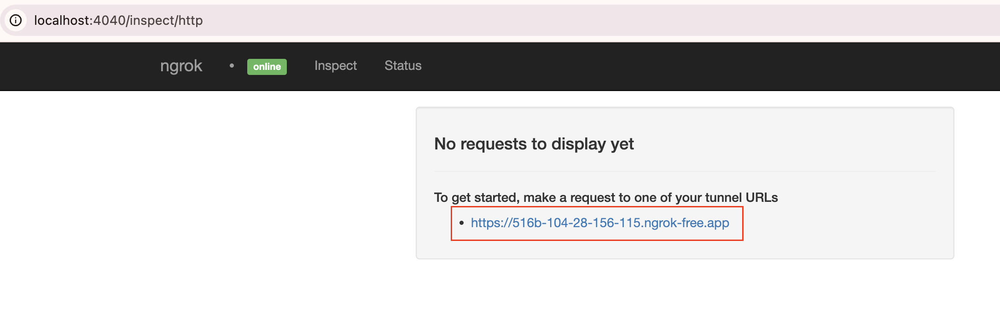

# Xsolla Client-Side Integration Example

This repository offers an example of integrating Xsolla PayStation for payment processing using Maven, Java, Servlets,
Tomcat, and Ngrok.

## Prerequisites

Ensure the following tools are installed on your system before proceeding:

- [Docker](https://docs.docker.com/get-docker/)
- [Docker Compose](https://docs.docker.com/compose/install/)
- [Ngrok](https://ngrok.com/)

## Setup Instructions

### 1. Create the .env file

Copy the .env.example file and rename it to .env:

```bash
cp .env.example .env
```

Update the .env file with the appropriate values. Your project ID is available in your Xsolla Publisher Account.


### 2. Create login project

In your Xsolla Publisher Account -> your project -> Login -> New login project
Or open the page: https://publisher.xsolla.com/<YOUR_MERCHANT>/projects/<YOUR_PROJECT>/login

And copy your Login ID to .env

### 3. Build the project with Maven

```markdown
mvn clean install
```

The output xsolla-example.war file will be in the target directory.

**It's crucial to remember that your project needs to be rebuilt whenever changes are made to the codebase or .env variables.**

### 4. Start Docker Containers

Run the project using Docker Compose:

**It's crucial to remember that your Docker need to be rebuilt too after every project rebuilt.**


```bash
docker-compose up --build
```

The application will be accessible at http://localhost:8080/xsolla-example/client-side.

### 5. Configure Ngrok


Ngrok provides a public URL for accessing your local server. You can open the Ngrok dashboard at http://localhost:4040.

Copy the resulting URL and append /xsolla-example/webhook to it (for example, https://<random>.ngrok-free.app/xsolla-example/webhook) and add it to the webhook settings of your project at https://publisher.xsolla.com/<YOUR_MERCHANT>/projects/<YOUR_PROJECT>/edit/webhooks/.


### 6. Add a product in Publisher Account

Create a product in your Xsolla Publisher Account. Navigate to your project > store > virtual items > add item, or open
the page directly at https://publisher.xsolla.com/<YOUR_MERCHANT>/projects/<YOUR_PROJECT>/storefront/virtual-items.

### 7. Test the payment process

Open the example UI at http://localhost:8080/xsolla-example/client-side.

Payment process:

1. Client: Push button "Auth" -> login -> for get auth token (field "User token" will be filled)
2. Game-client: Generate json data for payment -> received payment token -> redirect client to payment page
3. Server: Receive a webhook for validate user
4. Client: Make a payment
5. Server: Receive a webhook of payment result and provide a customer with a product 